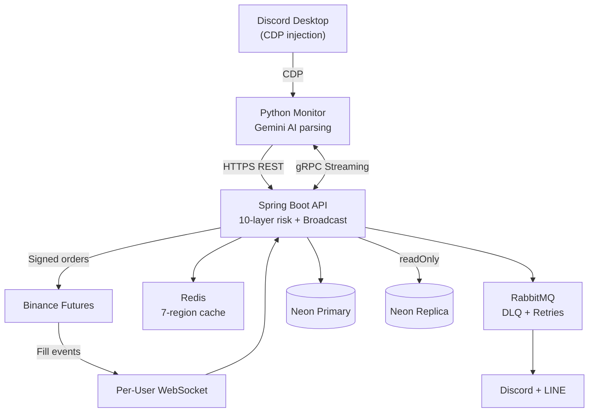

# Crypto Signal Trader

[](README.md)
[](README.en.md)

[](https://github.com/justinhsu1477/crypto-signal-trader/actions/workflows/ci.yml)


> Discord signals → AI parsing → multi-user Binance Futures auto-trading

Automatically converts messages from Discord signal channels into Binance Futures orders. **Multi-user SaaS support**: signal broadcasting, per-user risk controls, USDT subscription billing, and an admin Discord chatbot.

---

## How It Works

```
[Discord signal]
   ↓ CDP injection
[Python Monitor (local)] ── Gemini AI parsing (text / image / compound actions)
   ↓ HTTPS REST
[Spring Boot backend (cloud VM)] ── 10-layer risk + broadcast dispatch
   ↓
[Binance Futures API] ── per-user API key + per-user WebSocket
```

The two halves run on different machines:
- **Python** (`discord-monitor/`) runs locally on a Mac — uses CDP to inject into the Discord desktop app and captures `MESSAGE_CREATE` events
- **Java** (`src/main/java/`) runs on a cloud VM — Docker Compose + Caddy + multi-user dispatch
- **gRPC streaming** lets Java push config (channel whitelist, prompt versions, etc.) to local Python in real time

---

## Highlights

### 1. Multimodal AI Signal Parsing
- **Text signals**: Gemini 2.5 Flash + custom SYSTEM_PROMPT (70+ few-shot examples)
- **Image signals**: Vision LLM extracts trade params from banner-style screenshots (some channels post signals as images to evade text scrapers)
- **Compound actions**: Recognizes patterns like "TP 50% + move SL to breakeven" → automatically issues CLOSE 50% + MOVE_SL to breakeven (with fee compensation)

### 2. Multi-User Broadcast Trading
- One signal → parallel dispatch to all subscribed users (broadcastExecutor 5–20 threads, aligned with DB pool size)
- **Per-user isolation**: API keys (AES-256-GCM encrypted) / risk params / notification channels are independent
- **Per-user WebSocket**: SL/TP fills trigger real-time PnL sync

### 3. 10-Layer Risk Control
Whitelist → Balance → Daily loss circuit breaker → Position count → DCA depth → Signal dedup (4 layers) → Stop-loss validation → Price deviation → Notional value cap → Min order size

### 4. Real-Time Admin Chatbot (Discord)
DM the bot directly:
- "Show all users' balances" → real-time Binance API query
- "This week's user PnL" → time-window aggregation (7d/30d/90d)
- "Today's signal status" → signals + broadcast outcomes (success/fail/skipped)

<p align="center">
  
  <br/>
  <em>Admin DM: "Check all users' balances" → Bot instantly fetches each user's Binance USDT balance and lists them</em>
</p>

### 5. Full Audit Trail
- DB: `trades` / `signals` / `broadcast_logs` (with AI confidence + per-user result JSON)
- Image signal `sha256` persisted (traceable: which image triggered which trade)
- Prometheus metrics: `signal_image_total`, `signal_compound_total`, `chatbot_llm_calls_total`, etc.

<p align="center">
  
  <br/>
  <em>Web Dashboard — System Overview (DB / Binance / WebSocket health, user stats, Today/Week/Month PnL)</em>
</p>

---

## System Architecture



---

## Tech Stack

| Layer | Stack |
|---|---|
| Backend | Java 17 + Spring Boot 3.2.5 + Gradle |
| Frontend | Next.js 14 + shadcn/ui + i18n (en / zh-TW / zh-CN) |
| DB | Neon Postgres 16 (Primary + Read Replica) + Flyway migrations |
| Cache | Redis 7 (7 isolated regions + Graceful Degradation) |
| MQ | RabbitMQ 3 (DLQ + exponential backoff retries) |
| AI | Gemini 2.5 Flash (parsing + scoring + advisor + image) |
| Auth | JWT HttpOnly Cookie + LINE OAuth + RBAC + Email verification |
| Subscription | USDT TRC20 on-chain verification (TronGrid) |
| Comms | gRPC streaming + REST + AMQP + WebSocket |
| Deployment | Docker Compose + Caddy + Cloudflare + GitHub Actions CI/CD |
| Listener | Python 3.10+ + CDP (Chrome DevTools Protocol) |
| Testing | **2321+ tests** (JUnit 5 + Mockito + pytest) |

---

## Quick Start

```bash
# 1. Clone + env vars
git clone https://github.com/justinhsu1477/crypto-signal-trader.git
cd crypto-signal-trader
cp .env.example .env       # fill in BINANCE / GEMINI / DB / MONITOR_API_KEY ...

# 2. Cloud backend (run on VM)
docker compose -f docker-compose.cloud.yml up -d --build

# 3. Local Python Monitor (run on your Mac / Windows / Linux)
cd discord-monitor
pip install -r requirements.txt
./launch_discord.sh 9222   # launch Discord desktop with debug port
python -m src.main --config config.yml

# 4. Verify
curl https://your-domain.com/api/health/deep
```

See `.env.example` for required environment variables. Deployment details: `docs/architecture-roadmap.md`.

---

## Modules

```
trading       Core trading (risk + ordering + broadcast + WebSocket + TradeContext)
chatbot       Admin Discord bot (function calling + AI assistant + conversation history)
notification  Discord/LINE multichannel notifications (async via RabbitMQ)
auth          JWT + LINE OAuth + Rate Limiting + Email verification
user          Account + encrypted API keys + trade settings + webhooks
subscription  USDT TRC20 subscription billing (on-chain verification)
dashboard     Performance analytics + broadcast logs + admin management
advisor       AI trading advisor (Gemini hourly analysis + signal confidence scoring)
referral      Referral system (invite codes + commission tracking)
shared        Shared components (Config / DTO / Cache / Rate Limiter)
```

**Dependency rules**: no cycles, no reverse dependencies. See `CLAUDE.md`.

---

## Recent Additions (2026-05)

- 🖼️ **Image signal parsing**: Vision LLM auto-extracts trade params from images (feature-flagged)
- 🔀 **Compound action recognition**: "TP X% + cost protection" → CLOSE + MOVE_SL (channel-agnostic)
- 🤖 **Admin chatbot tools**: real-time balances / per-user PnL with time range / today's signal status
- 📊 **Observability upgrade**: sha256 audit chain + Prometheus counters + deep health check (incl. heartbeat + Discord bot status)
- 🛡️ **Multi-layer dedup**: Python message_id + content_hash + Java signal_hash (5min) + DB sourceMessageId (permanent)

---

## Monitoring

- **Health**: `/api/health` (liveness) + `/api/health/deep` (DB + Binance + heartbeat + Discord bot)
- **Prometheus**: `/actuator/prometheus` (chatbot LLM, signal image/compound, trade outcomes)
- **Heartbeat**: Python Monitor reports every 30s, flagged DEGRADED after 90s
- **DLQ**: RabbitMQ dead-letter queue polled regularly + admin alerts
- **Weekly report**: Auto-pushed to Admin Discord every Monday 09:00 (last week's performance)
