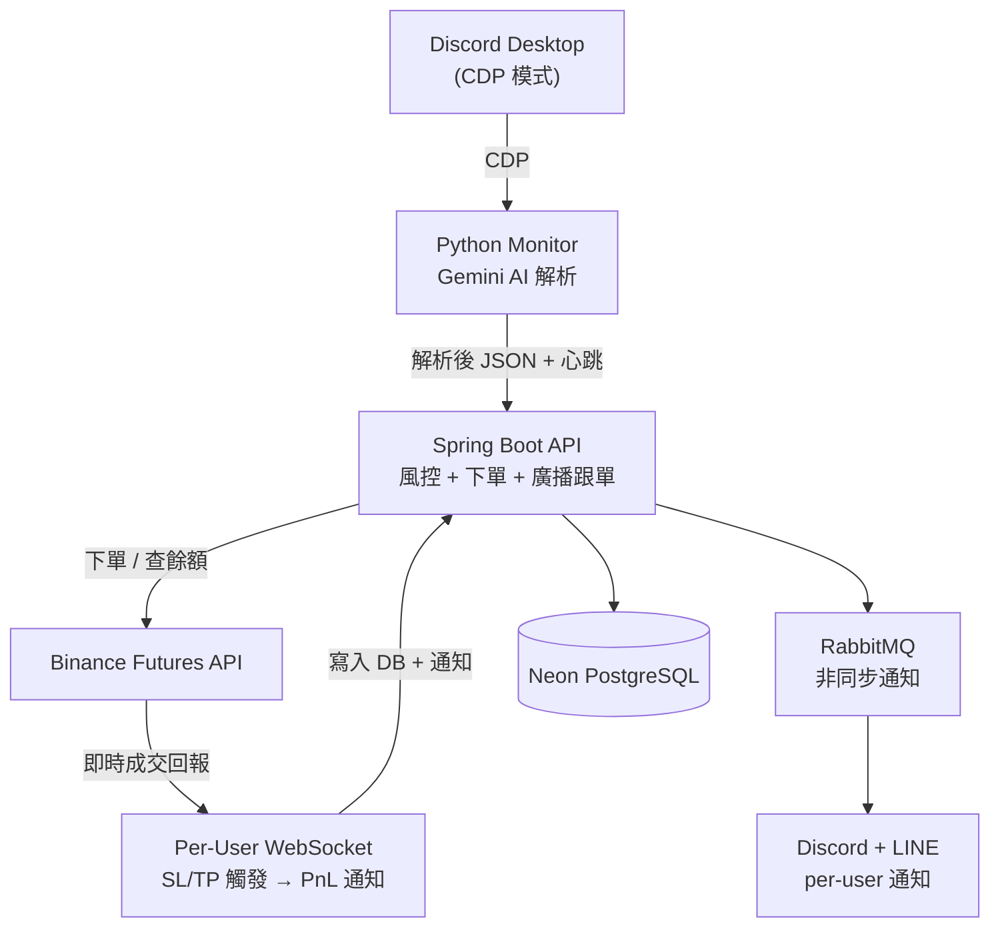
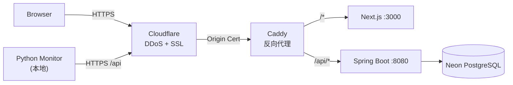

# Crypto Signal Trader

Discord 交易訊號自動跟單系統 — 監聽 Discord 頻道訊號，AI 解析後自動在 Binance Futures 下單。

支援**多用戶 SaaS 模式**：訊號廣播跟單、per-user 風控參數、USDT 訂閱計費。

---

## 系統架構



### 部署架構



**基礎設施：** DigitalOcean VM + Cloudflare CDN + Neon Serverless DB + GitHub Actions CI/CD

---

## 模組架構

```
com.trader/
├── trading/         # 交易核心（開倉/平倉/風控/WebSocket/廣播跟單）
├── notification/    # 多頻道通知（Discord + LINE，RabbitMQ 非同步）
├── auth/            # 認證（JWT HttpOnly Cookie + Monitor API Key + Email 驗證）
├── user/            # 用戶（帳號/加密 API Key/交易參數/Webhook）
├── subscription/    # 訂閱計費（USDT TRC20 鏈上驗證）
├── dashboard/       # Dashboard API（績效分析/持倉/交易紀錄）
├── referral/        # 推薦系統（邀請碼/佣金追蹤）
├── shared/          # 共用元件（Config/DTO/工具類/Rate Limiter）
└── advisor/         # AI 交易顧問（Gemini 定時分析）
```

**模組依賴（不可循環）：**
```
auth → user    subscription → user, shared    dashboard → trading, user, subscription, shared
trading → shared, notification    referral → user, shared    user → (nothing)    shared → (nothing)
```

---

## 核心功能

### 交易引擎

| 功能 | 說明 |
|------|------|
| 以損定倉 | `1R = 餘額 × risk%`，倉位 = 1R ÷ 止損距離 |
| DCA 補倉 | 最多 3 層，2R 加碼，自動重掛 SL/TP |
| 部分平倉 | 平 50% 後自動重掛 SL/TP，可做成本保護 |
| Fail-Safe | SL 失敗 → 取消入場 → 市價平倉 → 告警 |

### 10 層風控

| # | 檢查 |
|---|------|
| 1 | 交易對白名單 |
| 2 | 帳戶餘額驗證 |
| 3 | 每日虧損熔斷 |
| 4 | 持倉數 / DCA 層數限制 |
| 5 | 重複掛單 + 訊號三層去重 |
| 6 | 止損必填 + 方向驗證 |
| 7 | 價格偏離 >10% 拒絕 |
| 8 | 名目價值 cap |
| 9 | 保證金 < 90% 餘額 |
| 10 | 最低下單量 > 5 USDT |

### 多用戶 SaaS

| 機制 | 說明 |
|------|------|
| 廣播跟單 | ADMIN 訊號 → 並行派發所有訂閱用戶（線程池 10~50） |
| Per-User 隔離 | API Key / 交易紀錄 / 風控參數 / 通知 各自獨立 |
| Per-User WebSocket | 每個用戶獨立 Data Stream，SL/TP 觸發即時同步 |
| 訂閱控制 | 未訂閱 / 過期 → 自動跳過廣播 |

### 通知系統（RabbitMQ 非同步）

| 頻道 | 模式 |
|------|------|
| Discord Webhook | per-user + Admin 彙總 |
| LINE Push API | per-user 推播 |
| RabbitMQ | 2 Queue + DLQ + 指數退避重試 |

---

## 安全架構

| 層級 | 機制 |
|------|------|
| 認證 | JWT HttpOnly Cookie（Access 30min / Refresh 3天）+ SameSite=Strict |
| RBAC | ADMIN / USER 角色，端點層級權限控制 |
| Monitor | API Key（X-Api-Key）→ ROLE_ADMIN |
| Rate Limiting | IP-based 多路徑限流（auth 10/min、trade 30/min、dashboard 60/min） |
| 加密 | API Key: AES-256-GCM / 密碼: BCrypt |
| Email 驗證 | OTP 驗證碼，註冊後啟用 |
| 審計 | 登入/登出/密碼變更全記錄（IP + timestamp） |

---

## 技術棧

| 層級 | 技術 |
|------|------|
| 後端 | Java 17 + Spring Boot 3.2.5 + Gradle |
| 前端 | Next.js 14 + React + shadcn/ui + i18n（en/zh-TW/zh-CN） |
| 資料庫 | PostgreSQL 16（Neon Serverless）+ Flyway 遷移 |
| 訊息佇列 | RabbitMQ 3（非同步通知 + DLQ） |
| AI | Gemini 2.0 Flash（訊號解析 + 交易顧問） |
| 訂閱 | USDT TRC20 鏈上驗證（TronGrid API） |
| 部署 | Docker Compose + Caddy + Cloudflare |
| CI/CD | GitHub Actions（gitleaks → build → test → Docker → deploy） |
| 測試 | JUnit 5 + Mockito — **1147+ tests passed** |

### 資料庫

| 表 | 說明 |
|---|------|
| `trades` / `trade_events` | 交易紀錄 + 事件日誌 |
| `signals` | 訊號紀錄（去重用） |
| `users` / `user_api_keys` | 帳號 + 加密 API Key |
| `user_trade_settings` / `user_discord_webhooks` | per-user 交易參數 + Webhook |
| `subscriptions` / `payment_history` | 訂閱 + USDT 付款紀錄 |
| `referral_links` | 推薦碼 + 佣金追蹤 |
| `audit_logs` | 安全審計紀錄 |

---

## 快速開始

```bash
# 1. 環境變數
cp .env.example .env    # 填入 API Keys

# 2. Cloud 部署
docker compose -f docker-compose.cloud.yml up -d --build

# 3. Python Monitor（本地）
cd discord-monitor && python3 -m src.main --config config.yml

# 4. 驗證
curl https://your-domain.com/api/health
```

### 關鍵環境變數

| 變數 | 說明 |
|------|------|
| `BINANCE_API_KEY` / `SECRET_KEY` | 幣安 API |
| `DB_URL` / `DB_USERNAME` / `DB_PASSWORD` | PostgreSQL (Neon) |
| `RABBITMQ_HOST` | RabbitMQ |
| `MONITOR_API_KEY` | Python Monitor 認證 |
| `JWT_SECRET` / `AES_ENCRYPTION_KEY` | 認證 / 加密 |
| `MULTI_USER_ENABLED` | `true` = 多用戶 SaaS |

---

## 監控

| 機制 | 說明 |
|------|------|
| 心跳 | Python Monitor 每 30 秒回報，>90 秒告警 |
| WebSocket | Per-user Data Stream，斷線指數退避重連（1s→60s，20 次上限） |
| 每日排程 | 07:55 殭屍清理 + 08:00 每日摘要（per-user） |
| 健康檢查 | `/api/health`（輕量）+ `/api/health/deep`（DB + API 配額） |
| AI 顧問 | Gemini 每日 6 次分析交易表現 |

---

## 開發狀態

| 狀態 | 功能 |
|------|------|
| ✅ | 交易核心（開倉/平倉/DCA/部分平倉/Fail-Safe/10 層風控） |
| ✅ | Discord CDP 監聽 + Gemini AI 解析 + 本地訊號佇列 |
| ✅ | 多用戶 SaaS（廣播跟單/per-user 隔離/per-user WebSocket） |
| ✅ | RabbitMQ 非同步通知（Discord + LINE，DLQ + 重試） |
| ✅ | 認證系統（JWT HttpOnly + RBAC + Email 驗證 + Rate Limiting） |
| ✅ | USDT TRC20 訂閱計費（鏈上驗證） |
| ✅ | 推薦系統（邀請碼 + 佣金追蹤） |
| ✅ | Web Dashboard（Next.js + i18n 三語系） |
| ✅ | CI/CD（GitHub Actions → GHCR → DigitalOcean 自動部署） |
| ✅ | 1147+ 後端測試 + 27 Python 測試 |
