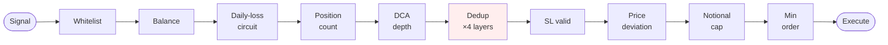
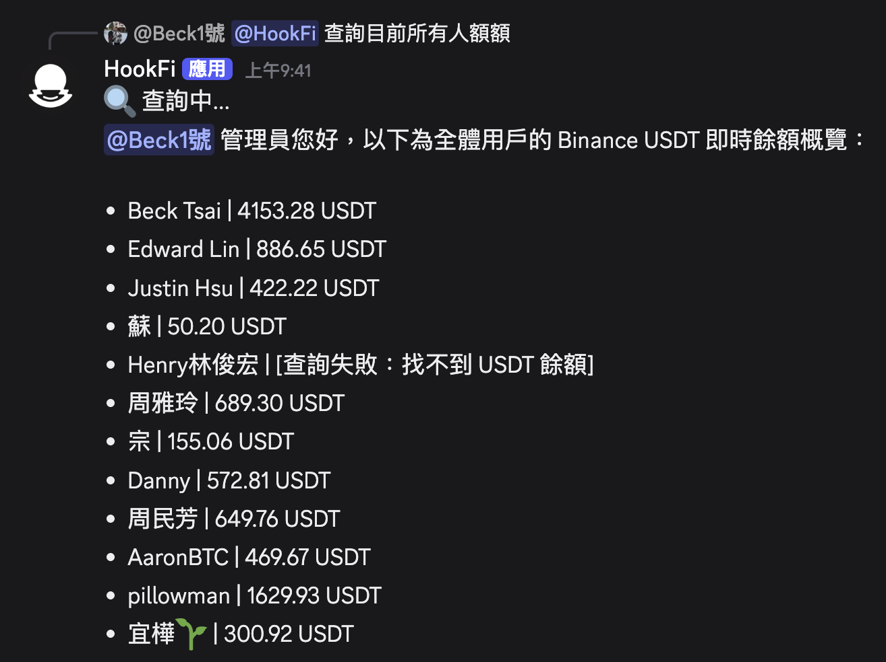
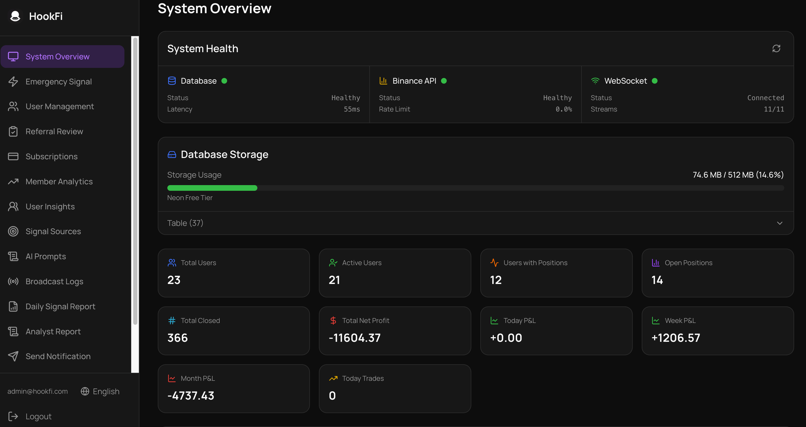
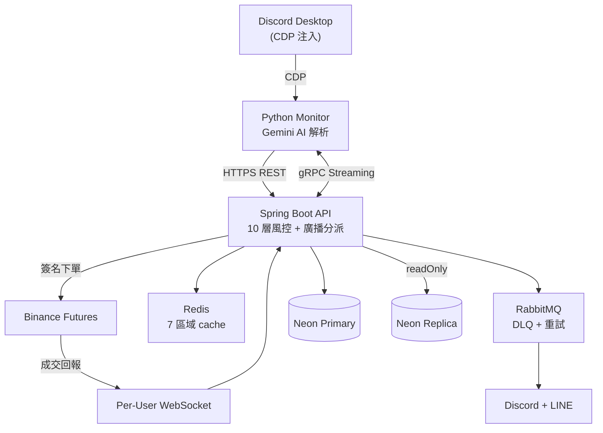

# Crypto Signal Trader

[](README.md)
[](README.en.md)

[](https://github.com/justinhsu1477/crypto-signal-trader/actions/workflows/ci.yml)


> Discord 訊號 → AI 解析 → 多用戶 Binance Futures 自動跟單

把 Discord 訊號頻道的訊息自動轉換成 Binance Futures 訂單，**支援多用戶 SaaS 模式**：訊號廣播跟單、per-user 風控、USDT 訂閱計費、Admin Discord chatbot。

- 📖 [Engineering Case Study](docs/CASE_STUDY.md) — 設計決策、5 個真實踩坑、testing strategy、deployment
- 🛡️ [SECURITY.md](SECURITY.md) — 8 個 attack surface 的威脅模型 + 漏洞揭露流程

---

## 怎麼運作

```
[Discord 訊號]
   ↓ CDP 注入
[Python Monitor（本地）] ── Gemini AI 解析（文字 / 圖片 / 複合動作）
   ↓ HTTPS REST
[Spring Boot 後端（雲端 VM）] ── 10 層風控 + 廣播分派
   ↓
[Binance Futures API] ── per-user API Key + per-user WebSocket
```

兩個半邊跑在不同機器：
- **Python**（`discord-monitor/`）跑在你 Mac 本地 — CDP 注入 Discord 桌面攔 `MESSAGE_CREATE` event
- **Java**（`src/main/java/`）跑在雲端 VM — Docker Compose + Caddy + 多用戶分派
- **gRPC streaming** 讓 Java 即時推設定下來（頻道白名單、prompt 版本等）

---

## 特色亮點

### 1. AI 多模態訊號解析
- **文字訊號**：Gemini 2.5 Flash + 自訂 SYSTEM_PROMPT（70+ few-shot）
- **圖片訊號**：Vision LLM 抽取 banner 樣式截圖中的交易參數（部分頻道用圖片發訊號規避文字爬蟲）
- **複合動作**：辨識「止盈50%做成本保护」→ 自動 CLOSE 50% + MOVE_SL 到 breakeven（含手續費補償）

### 2. 多用戶廣播跟單
- 一筆訊號 → 並行分派所有訂閱用戶（broadcastExecutor 5~20 threads，對齊 DB pool）
- **per-user 隔離**：API Key（AES-256-GCM 加密）/ 風控參數 / 通知頻道 各自獨立
- **per-user WebSocket**：SL/TP 觸發即時同步 PnL

### 3. 10 層風控

訊號從進來到下單必須通過 10 個 gate，任一拒則整單拒 + 寫 audit log：



實作在 [BinanceFuturesService](src/main/java/com/trader/trading/service/BinanceFuturesService.java) + [SignalDeduplicationService](src/main/java/com/trader/trading/service/SignalDeduplicationService.java)。

### 4. 即時 Admin Chatbot（Discord）
DM bot 直接問：
- 「所有用戶餘額」→ 真實 Binance API 查詢
- 「本週用戶獲利」→ 時間區間 PnL（7d/30d/90d）
- 「今天訊號狀況」→ 訊號 + 廣播成功/失敗/跳過聚合

<p align="center">
  
  <br/>
  <em>Admin DM 「查詢目前所有人額額」→ Bot 即時抓取每位用戶 Binance USDT 餘額並列出</em>
</p>

### 5. 完整審計鏈
- DB：`trades` / `signals` / `broadcast_logs`（含 AI 信心 + per-user 結果 JSON）
- 圖訊號 `sha256` 落地（可追溯哪張圖觸發哪筆交易）
- Prometheus metrics：`signal_image_total`、`signal_compound_total`、`chatbot_llm_calls_total` 等

<p align="center">
  
  <br/>
  <em>Web Dashboard — System Overview（DB / Binance / WebSocket 健康狀態、用戶統計、Today/Week/Month PnL）</em>
</p>

---

## 系統架構



---

## 技術棧

| 層 | 技術 |
|---|---|
| 後端 | Java 17 + Spring Boot 3.2.5 + Gradle |
| 前端 | Next.js 14 + shadcn/ui + i18n（en / zh-TW / zh-CN）|
| DB | Neon Postgres 16（Primary + Read Replica）+ Flyway 遷移 |
| Cache | Redis 7（7 區域獨立 TTL + Graceful Degradation）|
| MQ | RabbitMQ 3（DLQ + 指數退避重試）|
| AI | Gemini 2.5 Flash（解析 + 評分 + 顧問 + 圖片）|
| 認證 | JWT HttpOnly Cookie + LINE OAuth + RBAC + Email 驗證 |
| 訂閱 | USDT TRC20 鏈上驗證（TronGrid）|
| 通訊 | gRPC streaming + REST + AMQP + WebSocket |
| 部署 | Docker Compose + Caddy + Cloudflare + GitHub Actions CI/CD |
| 監聽 | Python 3.10+ + CDP（Chrome DevTools Protocol）|
| 測試 | **2321+ tests** (JUnit 5 + Mockito + pytest) |

---

## 快速開始

```bash
# 1. Clone + 環境變數
git clone https://github.com/justinhsu1477/crypto-signal-trader.git
cd crypto-signal-trader
cp .env.example .env       # 填入 BINANCE / GEMINI / DB / MONITOR_API_KEY ...

# 2. 雲端後端（VM 上跑）
docker compose -f docker-compose.cloud.yml up -d --build

# 3. 本地 Python Monitor（在 Mac / Windows / Linux 跑）
cd discord-monitor
pip install -r requirements.txt
./launch_discord.sh 9222   # 用 debug port 啟動 Discord 桌面
python -m src.main --config config.yml

# 4. 驗證
curl https://your-domain.com/api/health/deep
```

關鍵環境變數見 `.env.example`。詳細部署請參考 `docs/architecture-roadmap.md`。

---

## 模組

```
trading       核心交易（風控 + 下單 + 廣播 + WebSocket + TradeContext）
chatbot       Admin Discord bot（function calling + AI 客服 + 對話歷史）
notification  Discord/LINE 多頻道通知（RabbitMQ 非同步）
auth          JWT + LINE OAuth + Rate Limiting + Email 驗證
user          帳號 + 加密 API Key + 交易設定 + Webhook
subscription  USDT TRC20 訂閱計費（鏈上驗證）
dashboard     績效分析 + 廣播日誌 + Admin 管理
advisor       AI 交易顧問（Gemini 每小時分析 + 訊號信心評分）
referral      推薦系統（邀請碼 + 佣金追蹤）
shared        共用元件（Config / DTO / Cache / Rate Limiter）
```

**模組劃分**：以業務領域為單位，每個模組獨立 entity / service / controller。

---

## 監控

- **Health probes** — `/api/health` 探活 + `/api/health/deep`（DB / Binance / heartbeat / Discord bot）
- **Weekly AI eval cron** — 週一 09:00 跑 30-case eval → emoji-tier 摘要推到 admin Discord
- **Prometheus** — `/actuator/prometheus` 暴露 chatbot LLM / signal image+compound / trade outcomes
