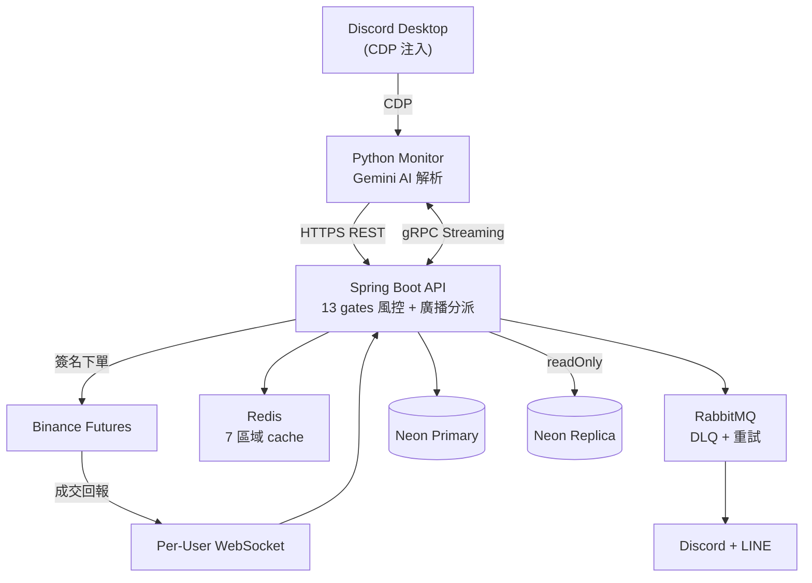

# Crypto Signal Trader

[](README.md)
[](README.en.md)

[](https://github.com/justinhsu1477/crypto-signal-trader/actions/workflows/ci.yml)


> Discord 訊號 → AI 解析 → 多用戶 Binance Futures 自動跟單

把 Discord 訊號頻道的訊息自動轉換成 Binance Futures 訂單，**支援多用戶 SaaS 模式**：訊號廣播跟單、per-user 風控、USDT 訂閱計費、Admin Discord chatbot。

- 📖 [Engineering Case Study](docs/CASE_STUDY.md) — 設計決策、5 個真實踩坑、testing strategy、deployment
- 🛡️ [SECURITY.md](SECURITY.md) — 8 個 attack surface 的威脅模型 + 漏洞揭露流程

---

## 🎯 為什麼自己寫

中文圈跟單 90% 集中在 Discord 訊號群，但**人為跟單**有 4 個結構性痛點：

| 痛點 | 實際發生的事 |
|------|--------------|
| 手速跟不上 | 群主貼「BTC 多 78000」→ 開幣安 → 算倉位 → 下單，至少 30 秒。市價已經 79000 |
| 半夜漏單 | 群主美西時間發訊號，亞洲用戶睡死，醒來訊號已過期 |
| 複合動作做錯 | 「平掉 BTC、ETH 再進」一句兩動作，新手只做一個 |
| 多群衝突 | 同時跟 5 個群，互相衝突的訊號要 0.5 秒判斷 |

而既有自動跟單工具都**不適合中文圈訊號群**：

- **3Commas / Cornix** — 英文圈為主，中文 LLM 解析爛，不認識「進多」「平掉」「TP-SL 修改」這類群內黑話
- **Discord Bot 跟單** — 要訊號源群主**主動架** bot 進群，群主通常直接拒絕
- **Telegram bot / MetaMask snap** — UI 不是中文圈習慣，且和 Discord 訊號源分離

→ 這套用 **user 自己的 Discord 桌面 client + CDP 注入監聽 + Gemini 中文解析 + 雲端執行**，從訊號源角度完全隱形（群主不需要知道你在跟單），且中文黑話、複合動作、圖片訊號都吃得下來。

---

## 📊 Production 現況

> Self-hosted production · 單人開發 3 個月（2026-02 → 05）· snapshot 2026-05-23

| 維度 | 規模 |
|------|------|
| **跑了多久** | Production daily-driven，real money on the line |
| **活躍用戶** | **21** 個 Binance Futures 真倉跟單 |
| **訊號源** | **151** 個 Discord 頻道，每月解析 **5,800+** 則訊息 |
| **訊號處理量** | 5,834 raw messages → **1,305** broadcasts → **900** trades executed |
| **端到端延遲** | < **3 秒**（訊號發出 → AI 解析 → 13-gate 風控 → 多用戶並行下單成交） |
| **程式碼規模** | Java **44.3k** + Python **4.4k** + TypeScript **29.7k** LoC |
| **測試覆蓋** | **2,428** Java unit + **329** Python + **30-case** AI eval（每週一 09:00 自動跑）|
| **開發節奏** | **596** commits · **51** Flyway migrations · **11** modules |
| **基礎設施** | DigitalOcean 2GB VM (Singapore) + Neon Postgres serverless + Caddy + Cloudflare |

---

## 怎麼運作

```
[Discord 訊號]
   ↓ CDP 注入
[Python Monitor（本地）] ── Gemini AI 解析（文字 / 圖片 / 複合動作）
   ↓ HTTPS REST
[Spring Boot 後端（雲端 VM）] ── 13 gates 風控 + 廣播分派
   ↓
[Binance Futures API] ── per-user API Key + per-user WebSocket
```

上半（CDP 注入）必須跑在本機 Chrome 旁邊；下半在雲端 VM。gRPC streaming 讓 Java 即時把設定（頻道白名單、prompt 版本等）推給本地 Python。

---

## 特色亮點

### 1. AI 多模態訊號解析
- **文字訊號**：Gemini 2.5 Flash + 自訂 SYSTEM_PROMPT（70+ few-shot）
- **圖片訊號**：Vision LLM 抽取 banner 樣式截圖中的交易參數（部分頻道用圖片發訊號規避文字爬蟲）
- **複合動作**：辨識「止盈50%做成本保护」→ 自動 CLOSE 50% + MOVE_SL 到 breakeven（含手續費補償）

### 2. 多用戶廣播跟單
- 一筆訊號 → 並行分派所有訂閱用戶（broadcastExecutor 5~20 threads，對齊 DB pool）
- **per-user 隔離**：API Key（AES-256-GCM 加密）/ 風控參數 / 通知頻道 各自獨立
- **per-user WebSocket**：SL/TP 觸發即時同步 PnL

### 3. 多閘門風控管線（13 gates / 4 階段）

每筆訊號送進 [`BinanceFuturesService.executeSignalInternal`](src/main/java/com/trader/trading/service/BinanceFuturesService.java#L750) 後，必須依序通過 4 階段共 13 個 gate，任何一關掛掉都拒單、寫 audit log。

**A. 進場資格**（3）
1. **Symbol whitelist** — 不在 `allowedSymbols` 直接拒
2. **每日虧損熔斷** — 已實現虧損 ≥ `min(SOD × 80%, 2000 USDT)` 整日停單
3. **持倉狀態 + DCA 層數** — 已有倉只允許 DCA、層數 ≤ 3、方向必須一致

**B. 訊號去重**（5 — 不同層擋不同攻擊面）
4. **Binance open orders** — 已掛單未成交不再下，避免重複 LIMIT 單
5. **In-memory 5 min** — process 內 `ConcurrentMap`，O(1) 擋同批次重放
6. **DB 5 min** — `trades.signal_hash + created_at` 查詢，跨 restart 還在
7. **Per-user 5 min** — `userId` 入 hash，**同訊號不同 user 可下**、同 user 不重複
8. **CANCEL 30 sec** — CANCEL 訊號專用短窗，擋使用者快速 retry

**C. 訊號合理性**（2）
9. **止損驗證** — 非 DCA 必須帶 SL，且方向對（LONG: SL < entry / SHORT: SL > entry）
10. **價格偏離** — entry 與 Binance markPrice 差 > 10% 拒單，防 stale 訊號

**D. 倉位 size 算式**（3）
11. **Notional cap** — 單筆名目價值 ≤ `min(balance × maxPositionPercent, 50k USDT)`
12. **Margin cap** — 所需保證金 ≤ 90% 可用餘額，防爆倉
13. **Min notional** — 算完 < 5 USDT 整單拒（Binance min order）

去重邏輯抽在 [`SignalDeduplicationService`](src/main/java/com/trader/trading/service/SignalDeduplicationService.java)，size 算式跟 entry gate 在 `BinanceFuturesService` 主流程。Config 可調的有 8 個（whitelist / daily-loss-percent / max-daily-loss-usdt / max-dca-per-symbol / dca-risk-multiplier / max-position-percent / max-position-usdt / dedup-enabled），其餘為 hardcoded 安全下限。

### 4. 即時 Admin Chatbot（Discord）
DM bot 直接問：
- 「所有用戶餘額」→ 真實 Binance API 查詢
- 「本週用戶獲利」→ 時間區間 PnL（7d/30d/90d）
- 「今天訊號狀況」→ 訊號 + 廣播成功/失敗/跳過聚合

<p align="center">
  
  <br/>
  <em>Admin DM 「查詢目前所有人額額」→ Bot 即時抓取每位用戶 Binance USDT 餘額並列出</em>
</p>

### 5. 完整審計鏈
- **DB**：`trades` / `signals` / `broadcast_logs`（含 AI 信心 + per-user 結果 JSON）+ 圖訊號 `sha256` 落地，可追溯哪張圖觸發哪筆交易
- **Prometheus**：`signal_image_total` / `signal_compound_total` / `chatbot_llm_calls_total` 等業務指標

---

## 系統架構



---

## 技術棧

| 層 | 技術 |
|---|---|
| 後端 | Java 17 + Spring Boot 3.2.5 + Gradle |
| 前端 | Next.js 14 + shadcn/ui + i18n（en / zh-TW / zh-CN）|
| DB | Neon Postgres 16（Primary + Read Replica）+ Flyway 遷移 |
| Cache | Redis 7（7 區域獨立 TTL + Graceful Degradation）|
| MQ | RabbitMQ 3（DLQ + 指數退避重試）|
| AI | Gemini 2.5 Flash（解析 + 評分 + 顧問 + 圖片）|
| 認證 | JWT HttpOnly Cookie + LINE OAuth + RBAC + Email 驗證 |
| 訂閱 | USDT TRC20 鏈上驗證（TronGrid）|
| 通訊 | gRPC streaming + REST + AMQP + WebSocket |
| 部署 | Docker Compose + Caddy + Cloudflare + GitHub Actions CI/CD |
| 監聽 | Python 3.10+ + CDP（Chrome DevTools Protocol）|
| 測試 | **2,428 Java + 329 Python + 30 AI eval** (JUnit 5 + Mockito + pytest + Gemini eval harness) |

---

## 快速開始

> 給想 self-host 評估的人 — 完整環境變數 / VM 配置 / Caddy 設定見 [`docs/雲端部署架構圖.md`](docs/雲端部署架構圖.md)。

```bash
# 雲端後端
cp .env.example .env && docker compose -f docker-compose.cloud.yml up -d --build

# 本地 Python Monitor（CDP 必須跑在本機 Chrome 旁邊）
cd discord-monitor && pip install -r requirements.txt && python -m src.main --config config.yml
```

---

## 模組

```
trading       核心交易（風控 + 下單 + 廣播 + WebSocket + TradeContext）
chatbot       Admin Discord bot（function calling + AI 客服 + 對話歷史）
notification  Discord/LINE 多頻道通知（RabbitMQ 非同步）
auth          JWT + LINE OAuth + Rate Limiting + Email 驗證
user          帳號 + 加密 API Key + 交易設定 + Webhook
subscription  USDT TRC20 訂閱計費（鏈上驗證）
dashboard     績效分析 + 廣播日誌 + Admin 管理
advisor       AI 交易顧問（Gemini 每小時分析 + 訊號信心評分）
papertrade    紙上交易模擬（slippage / Sharpe / DD / auto-promote）
referral      推薦系統（邀請碼 + 佣金追蹤）
shared        共用元件（Config / DTO / Cache / Rate Limiter）
```

**依賴規則**：禁止循環、禁止反向。詳見 `CLAUDE.md`。

---

## 監控

- **Health probes** — `/api/health` 探活 + `/api/health/deep`（DB / Binance / heartbeat / Discord bot）
- **Weekly AI eval cron** — 週一 09:00 跑 30-case eval → emoji-tier 摘要推到 admin Discord
- **Prometheus** — `/actuator/prometheus` 暴露 chatbot LLM / signal image+compound / trade outcomes
