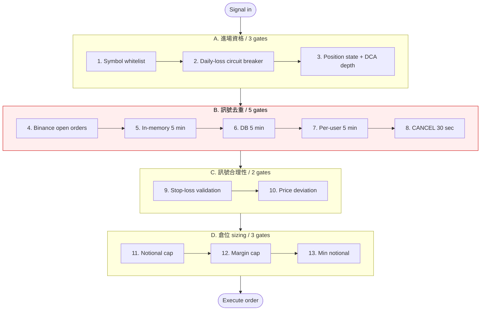

# Risk Pipeline — 13 個 gate / 4 階段

> 從 README「特色亮點 / 10 層風控」延伸 — 訊號送進 [`BinanceFuturesService.executeSignalInternal`](src/main/java/com/trader/trading/service/BinanceFuturesService.java#L750) 後，必須依序通過下列 13 個 gate。任一拒絕都會：拒單 + 記 `trades` outcome + 寫 audit log + 通知用戶。

## 拓樸

---

## A. 進場資格（3 gates）

| # | Gate | 拒單條件 | Config |
|---|------|---------|--------|
| 1 | **Symbol whitelist** | symbol 不在 `allowedSymbols` 清單 | `binance.risk.allowed-symbols` |
| 2 | **Daily-loss circuit breaker** | 已實現虧損 ≥ `min(SOD × daily-loss-percent, max-daily-loss-usdt)` | `binance.risk.daily-loss-percent` (default 0.80) / `max-daily-loss-usdt` (default 2000) |
| 3 | **Position state + DCA depth** | 已有倉只允許 DCA、層數 > 3、或方向不一致 | `binance.risk.max-dca-per-symbol` (default 3) / `dca-risk-multiplier` (default 2.0) |

## B. 訊號去重（5 gates — 不同層擋不同攻擊面）

| # | Gate | 擋什麼 | 視窗 |
|---|------|--------|------|
| 4 | **Binance open orders** | Binance 側已有未成交 LIMIT 單，避免重複下 | 即時查詢 |
| 5 | **In-memory `ConcurrentMap`** | 同批次 broadcast 內重放（O(1) lookup） | 5 min |
| 6 | **DB `trades.signal_hash + created_at`** | 跨 process restart 重放 | 5 min |
| 7 | **Per-user hash** | 同訊號**不同 user 可下**、同 user 不重複 | 5 min |
| 8 | **CANCEL hash** | 使用者快速 retry CANCEL 訊號 | 30 sec |

→ 邏輯抽在 [`SignalDeduplicationService`](src/main/java/com/trader/trading/service/SignalDeduplicationService.java)。

## C. 訊號合理性（2 gates）

| # | Gate | 拒單條件 |
|---|------|---------|
| 9 | **Stop-loss validation** | 非 DCA 訊號缺 SL；或 SL 方向錯（LONG 應 SL < entry / SHORT 應 SL > entry） |
| 10 | **Price deviation** | entry price 與 Binance markPrice 差距 > 10%（防 stale 訊號）|

## D. 倉位 sizing（3 gates — 算式串接）

| # | Gate | 規則 |
|---|------|------|
| 11 | **Notional cap** | 單筆名目價值 ≤ `min(balance × max-position-percent, max-position-usdt)` |
| 12 | **Margin cap** | 所需保證金 ≤ 90% 可用餘額（防爆倉，hardcoded） |
| 13 | **Min notional** | 算完 < 5 USDT 整單拒（Binance 最小單，hardcoded） |

---

## 失敗都會被記下來

每個 gate 拒單時：

1. `trades` 表寫 `outcome=REJECTED` + `reject_reason`
2. `broadcast_logs` 寫 per-user 結果 JSON
3. Discord webhook 通知 admin（嚴重等級 gate 才推用戶）
4. Prometheus counter `trade_reject_total{reason="..."}` +1

所以後續可以從 Grafana 直接看「哪個 gate 拒最多」，作為下一輪 tuning 的依據。

---

## 可調 / Hardcoded

| Tunable via env / yml (8 個) | Hardcoded（為安全下限）|
|---|---|
| `allowed-symbols` | 90% margin cap |
| `daily-loss-percent` | 10% price deviation |
| `max-daily-loss-usdt` | 5 USDT min notional |
| `max-dca-per-symbol` | 5 min dedup window |
| `dca-risk-multiplier` | 30 sec CANCEL window |
| `max-position-percent` | |
| `max-position-usdt` | |
| `dedup-enabled` | |
